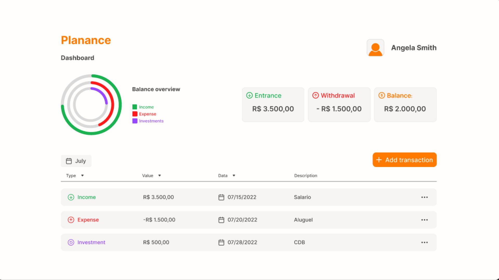

# Planance

## Índice

- [Sobre](#sobre)
- [Screenshots](#screenshots)
- [Links](#links)
- [Para desenvolvedores](#para-desenvolvedores)
  - [Rodando localmente](#rodando-localmente)
  - [Licença](#licença)
  
### Sobre

Planejador financeiro que simplifica o gerenciamento de ganhos e despesas.

### Screenshots

### Links

Visualize a página através desse [link](https://www.figma.com/proto/gqGpcKUGAWNbttogEQdy2A/planance?node-id=7-5&starting-point-node-id=7%3A5).

Obs: Clique em 'Login' para visualizar a página de exibição dos dados de planejamento financeiro (por se tratar de um protótipo, não é necessário inserir credenciais).

## Para Desenvolvedores

### Tecnologias

Figma - Ferramenta de desenvolvimento de protótipos.

### Licença

[MIT](https://choosealicense.com/licenses/mit/)
